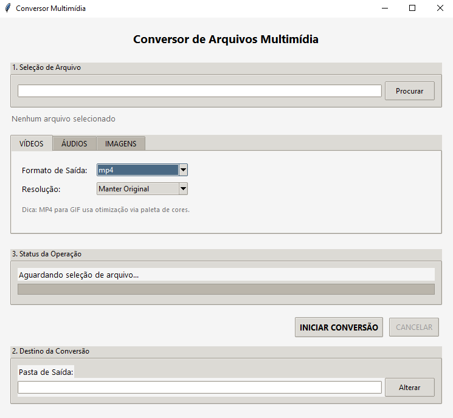

# Conversor de Arquivos Multimídia
Uma aplicação desktop portátil para conversão de arquivos de áudio, vídeo e imagem, com interface gráfica.



## 🌟 Recursos
- 🎵 **Conversão de Áudio**: MP3, WAV, FLAC, AAC, OGG, M4A, OPUS, ALAC, AIFF, AMR
- 📹 **Conversão de Vídeo**: MP4, MKV, AVI, MOV, WebM, FLV, WMV, 3GP, TS, M4V
- 🖼️ **Conversão de Imagem**: JPG, PNG, BMP, TIFF, HEIC, ICO, WebP, SVG
- 🎨 **Suporte a GIFs**: GIF, WebP animado, APNG
- ⚙️ **Controle de Qualidade**: Múltiplas opções de qualidade para cada formato
- 📂 **Seleção Personalizada**: Escolha livre de pastas de origem e destino
- 📦 **Aplicação Portátil**: Executável independente sem instalação
- 🔍 **Detecção Automática**: Identifica automaticamente o tipo de arquivo
- ✅ **Validação Inteligente**: Verificação de dependências e permissões
- ❌ **Cancelamento Seguro**: Interrompa conversões em andamento
- 🔄 **Prevenção de Sobrescrita**: Criação automática de versões numeradas

## 📋 Pré-requisitos
**Para desenvolvimento:**
- Python 3.6 ou superior
- tkinter (geralmente incluído com Python)
- [PyInstaller](https://pyinstaller.org/) (para criação do executável)

**Para execução do executável final:**
- Nenhum pré-requisito! A aplicação é completamente portátil.

## 🚀 Instalação para Desenvolvimento
1. Clone o repositório:
   ```bash
   git clone https://github.com/Joao-paulo19/conversor-multimidia.git
   cd conversor-multimidia
   ```

2. Instale as dependências:
   ```bash
   pip install pyinstaller
   ```

3. Baixe as ferramentas necessárias (não incluídas no repositório devido ao tamanho):
   - [ffmpeg.exe](https://ffmpeg.org/download.html) (baixe e coloque na pasta do projeto)
   - [ffprobe.exe](https://ffmpeg.org/download.html) (baixe e coloque na pasta do projeto)
   
   **Nota**: A aplicação verifica automaticamente se o FFmpeg está disponível localmente ou no PATH do sistema.

## 💻 Uso
### Executando a versão de desenvolvimento
```bash
python file_conversor.py
```

### Criando o executável
```bash
pyinstaller file_conversor.spec
```
O executável será criado na pasta `dist/Conversor Multimidia/`.

## 📝 Guia de Uso

### Conversão de Áudio
1. **Selecione o arquivo**: Clique em "Procurar..." e escolha seu arquivo de áudio
2. **Detecção automática**: O sistema detecta automaticamente o tipo e exibe informações
3. **Configure a conversão**: Na aba "Conversão de Áudio":
   - Escolha o formato de destino (MP3, FLAC, WAV, etc.)
   - Selecione a qualidade desejada (320kbps, 256kbps, 192kbps, etc.)
4. **Defina o destino**: Escolha a pasta onde salvar o arquivo convertido
5. **Converta**: Clique em "Converter" e acompanhe o progresso

### Conversão de Vídeo
1. **Selecione o vídeo**: Escolha seu arquivo de vídeo
2. **Configure na aba "Conversão de Vídeo"**:
   - Formato de destino (MP4, MKV, AVI, etc.)
   - Resolução (4K, 1080p, 720p, 480p, etc.)
3. **Defina destino e converta**

### Conversão de Imagem
1. **Selecione a imagem**: Escolha arquivo de imagem ou GIF
2. **Configure na aba "Conversão de Imagem"**:
   - Formato (JPG, PNG, WebP, etc.)
   - Qualidade JPEG (se aplicável)
3. **Converta**

### Recursos Avançados
- **Cancelamento**: Use "Cancelar" para interromper conversões
- **Arquivos duplicados**: O sistema cria versões numeradas automaticamente
- **Qualidade original**: Opção "Manter Original" preserva qualidade máxima
- **Formatos múltiplos**: Suporte completo para conversões entre qualquer formato

## 🛠️ Tecnologias Utilizadas
- [Python](https://www.python.org/) - Linguagem de programação principal
- [Tkinter](https://docs.python.org/3/library/tkinter.html) - Framework para interface gráfica
- [FFmpeg](https://ffmpeg.org/) - Motor de conversão multimídia
- [PyInstaller](https://pyinstaller.org/) - Criação de executável portátil

## 📁 Estrutura do Projeto
```
conversor-multimidia/
├── file_conversor.py      # Código principal da aplicação
├── file_conversor.spec    # Configuração do PyInstaller
├── ffmpeg.exe            # Motor de conversão (não incluído)
├── ffprobe.exe           # Análise de arquivos (não incluído)
├── icon.ico              # Ícone da aplicação (opcional)
├── README.md             # Este arquivo
└── screenshot.png        # Screenshot da interface
```

## 🎯 Formatos Suportados

| Categoria | Formatos Suportados |
|-----------|-------------------|
| **Áudio** | MP3, WAV, FLAC, AAC, OGG, M4A, OPUS, ALAC, AIFF, AMR |
| **Vídeo** | MP4, MKV, AVI, MOV, WebM, FLV, WMV, 3GP, TS, M4V |
| **Imagem** | JPG, PNG, BMP, TIFF, HEIC, ICO, WebP, SVG |
| **Animado** | GIF, WebP animado, APNG |

## 🐛 Solução de Problemas

### Problemas Comuns
- **"FFmpeg não encontrado"**: Baixe ffmpeg.exe e coloque na pasta da aplicação
- **"Sem permissão para escrever"**: Execute como administrador ou escolha outra pasta
- **"Tipo de arquivo não suportado"**: Verifique se o formato está na lista suportada
- **Conversão falha**: Verifique os logs em `conversor.log` para detalhes
- **Interface não responde**: Use "Cancelar" para interromper operações longas

### Dicas de Performance
- **Qualidade "Manter Original"** preserva qualidade mas gera arquivos maiores
- **Formatos sem perda** (FLAC, PNG) mantêm qualidade máxima
- **Conversões de vídeo** são mais lentas que áudio devido ao processamento

## 🤝 Contribuições
Contribuições são bem-vindas! Sinta-se à vontade para abrir uma issue ou enviar um pull request.

### Como Contribuir
1. Fork o projeto
2. Crie sua Feature Branch (`git checkout -b feature/NovaFuncionalidade`)
3. Commit suas alterações (`git commit -m 'Adiciona nova funcionalidade'`)
4. Push para a Branch (`git push origin feature/NovaFuncionalidade`)
5. Abra um Pull Request

## 📧 Contato
João Paulo - [@Joao-paulo19](https://github.com/Joao-paulo19)

LinkedIn: [https://www.linkedin.com/in/joao-paul0/](https://www.linkedin.com/in/joao-paul0/)  
Email: joaopaulomariaalvarenga@gmail.com

Link do projeto: [https://github.com/Joao-paulo19/conversor-multimidia](https://github.com/Joao-paulo19/conversor-multimidia)