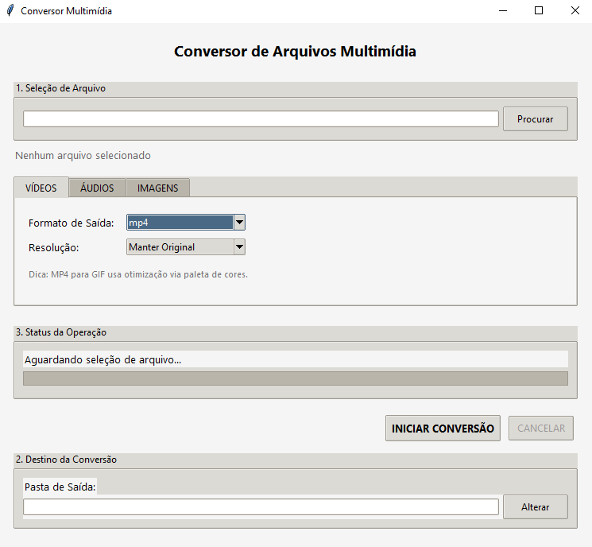

# Conversor de Arquivos Multimídia
Uma aplicação desktop portátil para conversão de arquivos de áudio, vídeo e imagem, utilizando o motor FFmpeg com uma interface gráfica intuitiva.



## ✨ Recursos Principais
- **Controle de Qualidade**: Múltiplas opções de bitrate para áudio e resoluções (até 4K) para vídeo.
- **Aplicação Portátil**: Executável único que não requer instalação.
- **Detecção Automática**: Identificação instantânea do tipo de mídia ao carregar o arquivo.
- **Processamento Assíncrono**: Conversões realizadas em segundo plano, mantendo a interface responsiva.
- **Prevenção de Sobrescrita**: Sistema inteligente que cria versões numeradas (ex: `video_1.mp4`) se o arquivo já existir.
- **Cancelamento Seguro**: Interrupção imediata de processos do FFmpeg via interface.

## 🚀 Recursos Extras
- **Interface em Abas**: Organização dedicada para Vídeos, Áudios e Imagens, otimizando o fluxo de trabalho.
- **Suporte a JFIF**: Conversão bidirecional completa para o formato JFIF na aba de imagens.
- **Motor de GIF de Alta Fidelidade**: Implementação de filtros complexos (`palettegen`) para criar GIFs com cores vibrantes e nitidez superior.
- **Conversão de Animações para Vídeo**: Transforme arquivos GIF, WebP animado e APNG diretamente em MP4 (H.264).
- **Suporte a Formatos Híbridos**: Detecção inteligente que permite processar arquivos como GIF, WebP e APNG tanto como vídeo quanto como imagem, dependendo da necessidade.

## 🛠️ Tecnologias Utilizadas
- **Python 3**: Linguagem base para lógica e integração.
- **Tkinter**: Interface gráfica nativa e leve.
- **FFmpeg/FFprobe**: Motores robustos de processamento multimídia.
- **Subprocess & Threading**: Gerenciamento de execução paralela.

## 📋 Formatos Suportados

| Categoria | Formatos Suportados |
|-----------|-------------------|
| **Vídeo** | MP4, MKV, AVI, MOV, WebM, FLV, WMV, **TS**, 3GP, M4V, GIF (Saída) |
| **Áudio** | MP3, WAV, FLAC, AAC, OGG, M4A, OPUS, ALAC, AIFF, AMR |
| **Imagem** | JPG, JPEG, **JFIF**, PNG, **APNG**, BMP, WebP, TIFF, ICO, SVG |

## ⚙️ Pré-requisitos
**Para desenvolvimento:**
- Python 3.6 ou superior.
- [PyInstaller](https://pyinstaller.org/) (para gerar o executável).
- **FFmpeg**: O executável `ffmpeg.exe` e `ffprobe.exe` devem estar na pasta raiz ou no PATH do sistema.

**Para uso final:**
- Nenhum! A aplicação é portátil (Standalone).

## 🔧 Instalação e Execução

1. **Clone o repositório:**
   ```bash
   git clone [https://github.com/Joao-paulo19/conversor-multimidia.git](https://github.com/Joao-paulo19/conversor-multimidia.git)
   cd conversor-multimidia

```
```
2. **Execute o script:**
```bash
python file_conversor.py

```


3. **Gere o executável (Portable):**
```bash
pyinstaller file_conversor.spec

```


*O executável será gerado na pasta `dist/`.*

## 📖 Guia de Uso

### 🎥 Vídeos e GIFs

1. Selecione um vídeo ou animação.
2. Na aba **VÍDEOS**, escolha o formato de saída (ex: MP4 ou GIF).
3. Selecione a resolução desejada. Ao converter para GIF, o sistema aplica automaticamente otimização de paleta de cores.

### 🎵 Áudios

1. Carregue seu arquivo de som.
2. Na aba **ÁUDIOS**, defina o formato (ex: FLAC para qualidade sem perda ou MP3 para economia de espaço).
3. Escolha o bitrate (até 320kbps).

### 🖼️ Imagens

1. Selecione uma imagem.
2. Na aba **IMAGENS**, escolha o destino. Para JPEGs, você pode ajustar o nível de compressão.
3. Use esta aba também para converter GIFs animados em MP4 estáticos.

## ⚠️ Solução de Problemas

* **FFmpeg não encontrado**: Certifique-se de que os binários do FFmpeg estão na mesma pasta do script ou do executável.
* **Erro em WebP animado**: Algumas versões do FFmpeg podem exigir bibliotecas específicas para decodificar WebP animado. Verifique se o seu binário possui suporte a `libwebp`.
* **Interface Travada**: Embora o sistema use Threads, conversões extremamente pesadas (como 4K) podem consumir muitos recursos do CPU. Use o botão "Cancelar" se necessário.

## 🤝 Contribuições

Sinta-se à vontade para abrir uma **Issue** ou enviar um **Pull Request**. Toda ajuda para expandir o suporte a novos formatos ou melhorar a UI é bem-vinda!

---

**João Paulo** - [@Joao-paulo19](https://github.com/Joao-paulo19)

[LinkedIn](https://www.linkedin.com/in/joao-paul0/) | [Email](mailto:joaopaulomariaalvarenga@gmail.com)
